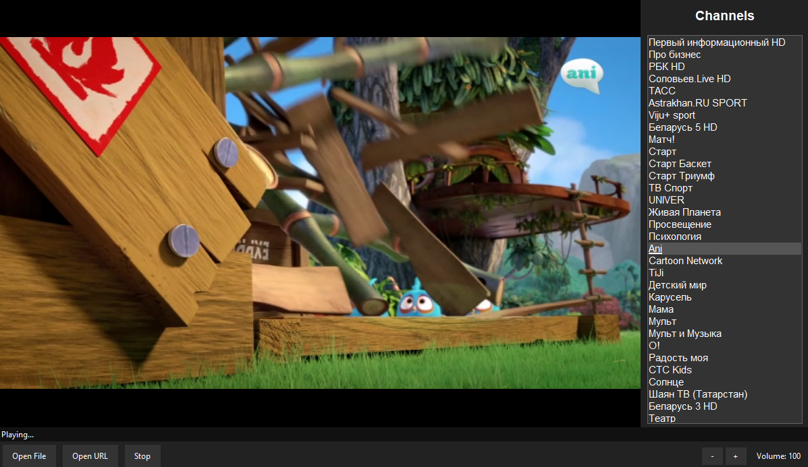

# 📺 MikroIptv

Лёгкий IPTV-плеер, написанный на Python.  
Воспроизводит IPTV-потоки по ссылке или из M3U-файла — **VLC не требуется**.  
Всё работает в одном окне со встроенным видео и звуком.



---

## ✨ Возможности

- 🎬 Воспроизведение IPTV-потоков по ссылке
- 📂 Открытие M3U-плейлистов из файла
- 🖥️ Встроенный видеоплеер (без внешних программ)
- 🔊 Встроенный звук
- 📺 Панель списка каналов (справа)
- 📅 Программа передач (EPG) — по правому клику на канал
- 🔉 Управление громкостью (100–200)
- 🖼️ Всё в одном окне
- ⚡ Лёгкий и быстрый
- 🖥️ Растягивание видео на весь экран (4:3 → 16:9)
- ❌ Закрытие по ESC или кнопкой окна

---

## 🚀 Установка

### Требования
- Python 3.8 или выше
- pip

### Установка зависимостей
```bash
pip install python-vlc pillow
```

### Установка VLC (нужен для воспроизведения)
- **Windows:** https://www.videolan.org/vlc/
- **Linux:** `sudo apt install vlc`
- **macOS:** `brew install vlc`

---

## 🎮 Использование

```bash
python mikroiptv.py
```

### Управление
| Действие | Описание |
|----------|----------|
| **Open File** | Загрузить M3U плейлист |
| **Open URL** | Воспроизвести поток по ссылке |
| **Двойной клик** по каналу | Запустить выбранный канал |
| **Правый клик** по каналу | Показать программу передач |
| **+ / -** | Управление громкостью (100–200) |
| **Stop** | Остановить воспроизведение |
| **ESC** | Закрыть расписание или выйти |
| **Крестик окна** | Выход из программы |

---

## 📺 Поддерживаемые форматы

- M3U / M3U8 плейлисты
- HTTP / HTTPS потоки
- HLS потоки
- MPEG-TS потоки

---

## 🛠️ Планируемые возможности

- [x] Парсинг M3U со списком каналов
- [x] Поддержка звука
- [x] Растягивание на весь экран
- [x] Переключение каналов
- [x] Управление громкостью
- [x] Программа передач (EPG)
- [ ] Настоящие данные EPG из XMLTV
- [ ] Список избранного
- [ ] Горячие клавиши
- [ ] Запись

---

## 📷 Скриншоты


*(Сюда можно добавить больше скриншотов)*

---

## 🤝 Участие в проекте

Приветствуются любые предложения!  
Создавайте issues или pull requests.

---

## 📄 Лицензия

Проект распространяется под лицензией **MIT License**.  
Подробнее в файле [LICENSE](LICENSE).

---

## 👤 Автор

**MikroTechMic**  
GitHub: [mikrotechmic](https://github.com/mikrotechmic)
